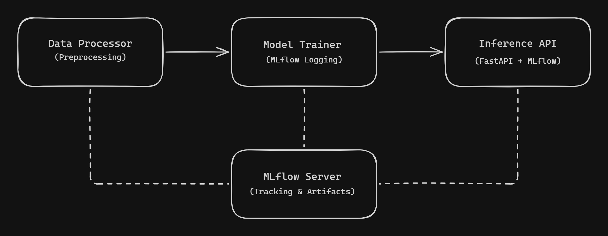
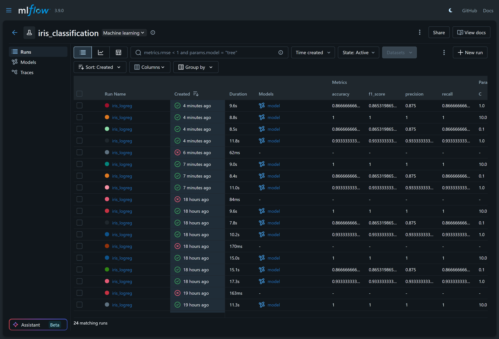
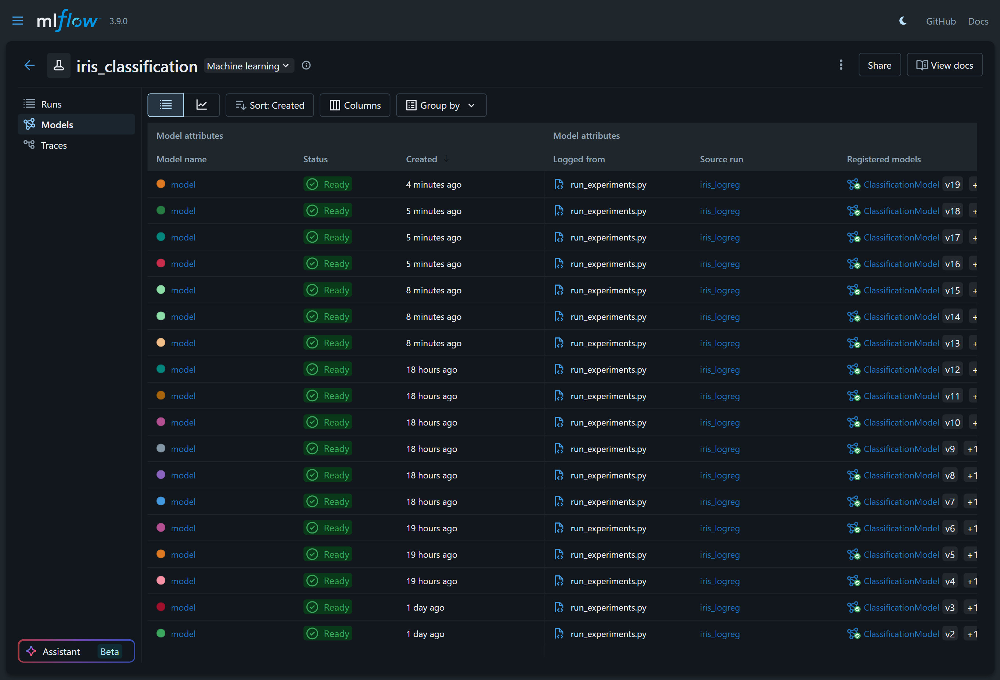
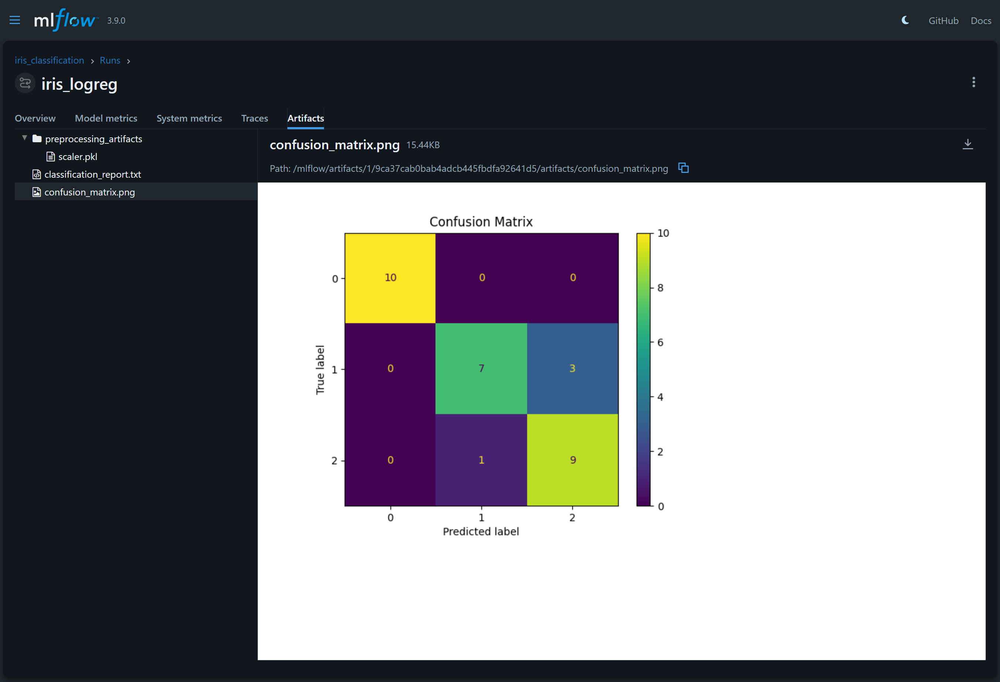
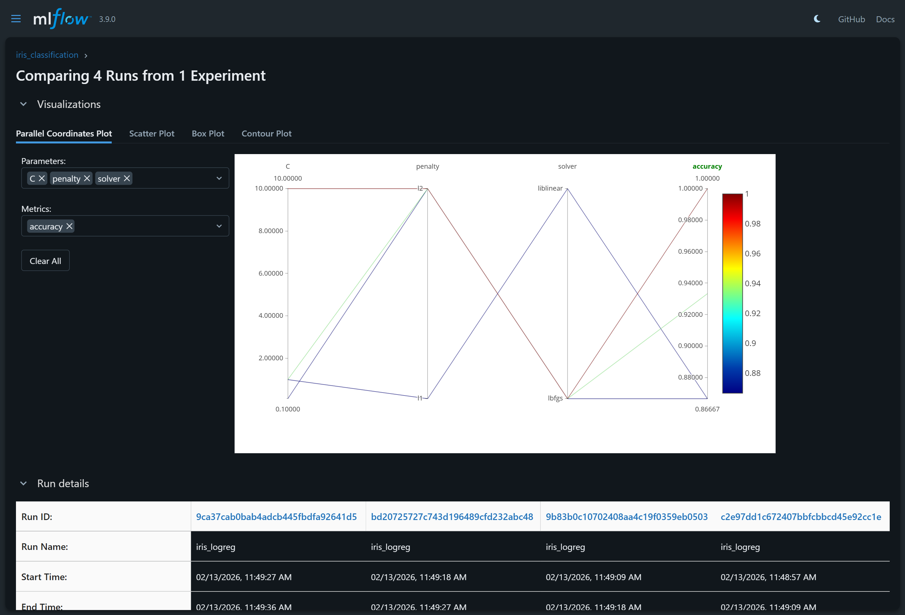

# mlflow-classification-pipeline

[](https://github.com/AkhileshMalthi/mlflow-classification-pipeline/actions/workflows/ci.yml)
[](https://www.python.org/downloads/)
[](LICENSE)

A production-ready machine learning classification pipeline using scikit-learn, MLflow, FastAPI, and Docker. This project demonstrates model training, experiment tracking, model registry, and serving predictions via a REST API.

---

## Architecture



---

## Setup Instructions

### Prerequisites

- Docker & Docker Compose
- Python 3.10+ (for local development)
- Git


### Clone the Repository

```sh
git clone https://github.com/AkhileshMalthi/mlflow-classification-pipeline.git
cd mlflow-classification-pipeline
```

---

## Running MLflow Experiments


1. **Install dependencies** (for local runs):

  You can use either `pip` or [`uv`](https://github.com/astral-sh/uv) (a fast Python package manager):

  ```sh
  # Using pip
  pip install -r requirements.txt

  # Or using uv (recommended for speed)
  uv pip install -r requirements.txt
  ```

2. **Start MLflow tracking server** (if not using Docker):

    ```sh
    mlflow server --host 0.0.0.0 --port 5000 --backend-store-uri sqlite:///mlflow.db --default-artifact-root ./mlruns
    ```


3. **Run multiple experiments** (recommended - executes 4 different hyperparameter configurations):

  > **Important:** For consistency and to avoid environment issues, run experiment and promotion scripts **inside the container** (unless your host environment exactly matches the container).

  ```sh
  docker-compose exec model_api python run_experiments.py
  ```

  This will train models with different hyperparameters and log all results to MLflow.

4. **Or train a single model:**

  ```sh
  docker-compose exec model_api python src/model_trainer.py
  ```

5. **Promote the best model to Production:**

  After running experiments, promote the best-performing model:

  ```sh
  docker-compose exec model_api python promote_model.py
  ```

  This will compare all model versions based on F1-score and promote the best one to Production stage.

---

## Accessing the MLflow UI

After starting the MLflow server (see Docker instructions below), open:

```
http://localhost:5000
```

You can view:
- Experiment runs and metrics
- Logged artifacts (confusion matrix, classification report, scaler)
- Registered models with descriptions and tags
- Model versions and stages (None, Staging, Production, Archived)

---

## Build and Run the Dockerized API

1. **Build and start all services:**

    ```sh
    docker-compose up --build
    ```

2. **Services:**
    - `mlflow_server`: MLflow tracking server (UI at port 5000)
    - `model_api`: FastAPI inference API (serving at port 8000)

---

## Testing the API

### Example: Health Check

```sh
curl http://localhost:8000/health
```

**Response:**
```json
{"status": "ok"}
```

### Example: Prediction

```sh
curl -X POST "http://localhost:8000/predict" \
     -H "Content-Type: application/json" \
     -d '{"features": [5.1, 3.5, 1.4, 0.2]}'
```

**Response:**
```json
{
  "prediction": [0],
  "probabilities": [[0.9127, 0.0583, 0.0290]]
}
```

> Adjust the `features` array to match your model's expected input (4 features for iris dataset).

### Python Example

```python
import requests
response = requests.post(
    "http://localhost:8000/predict",
    json={"features": [5.1, 3.5, 1.4, 0.2]}
)
result = response.json()
print(f"Predicted class: {result['prediction'][0]}")
print(f"Probabilities: {result['probabilities'][0]}")
```

---

## Running Unit Tests

```sh
docker-compose exec model_api pytest
```

Or locally:

```sh
pytest tests/
```

---

## MLflow UI Screenshots

After running the experiments, you can view comprehensive results in the MLflow UI at `http://localhost:5000`. Below are examples of key screens to document:

### 1. Experiment Runs



The experiment view shows all training runs with their key metrics. You can:
- Compare different hyperparameter configurations (C values, penalty types)
- Sort runs by metrics (F1-score, accuracy, precision, recall)
- View detailed run information including parameters, metrics, and artifacts

### 2. Registered Models



The Model Registry displays:
- All registered model versions
- Model stage lifecycle (None → Staging → Production → Archived)
- Model descriptions and tags (dataset, algorithm, f1_score)
- Version history and metadata

### 3. Run Details and Artifacts



Each run captures comprehensive artifacts:
- **Confusion Matrix**: Visual representation of model predictions vs actual labels
- **Classification Report**: Detailed precision, recall, and F1-scores per class
- **Preprocessing Artifacts**: Saved scaler for production inference
- **Model Artifacts**: MLmodel file with signature and dependencies

### 4. Metrics Comparison



Compare multiple runs side-by-side:
- Parameter variations (C=0.1 vs C=1.0 vs C=10.0, L1 vs L2)
- Performance metrics across all experiments
- Best model selection based on F1-score

> **Note**: These screenshots were captured from the MLflow UI after running the complete experiment workflow. To reproduce and view the results yourself, run:
> 1. `docker-compose up --build` to start services
> 2. `docker-compose exec model_api python run_experiments.py` to run all 4 experiments
> 3. Access http://localhost:5000 in your browser to explore the MLflow UI
> 4. `docker-compose exec model_api python promote_model.py` to promote the best model to Production

---

## Example Request/Response for `/predict`

**Request:**
```json
POST /predict
{
  "features": [5.1, 3.5, 1.4, 0.2]
}
```

**Response:**
```json
{
  "prediction": [0],
  "probabilities": [[0.9127, 0.0583, 0.0290]]
}
```

---

## Design Choices

- **MLflow** for experiment tracking, model registry, and artifact storage.
  - Logs parameters, metrics (accuracy, precision, recall, F1-score)
  - Logs artifacts (confusion matrix, classification report, scaler)
  - Model descriptions and tags for better organization
  - Model versioning with stage promotion (None → Production)
- **FastAPI** for high-performance, async REST API serving predictions.
  - Returns both class labels and probability distributions
  - Proper error handling with HTTP status codes
  - Lifespan event to load model and scaler only once at startup
- **Docker Compose** for reproducible, multi-service deployment.
- **Scikit-learn** for model training and preprocessing.
- **Automated experiment runs** via `run_experiments.py` with multiple hyperparameter configurations.
- **Model promotion script** (`promote_model.py`) to automatically select and promote best model.
- **Comprehensive unit tests** with pytest, mocked dependencies, and FastAPI's TestClient.
- **Environment variables** for flexible configuration (MLflow URI, model name, stage).

---

## License

MIT License

---

**Happy experimenting!**